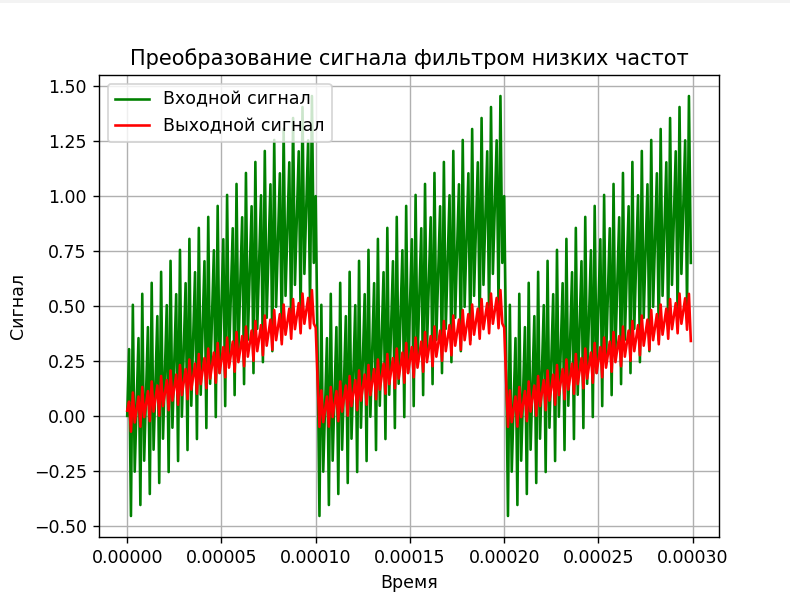
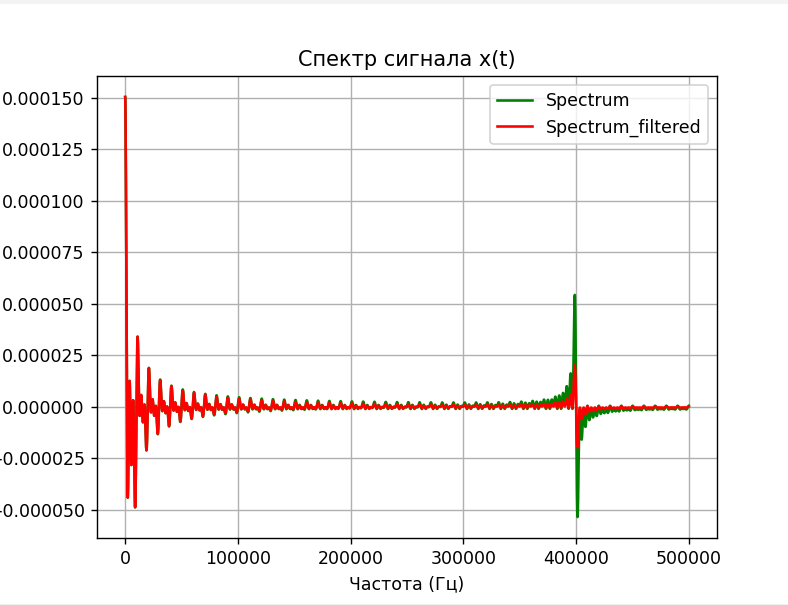

# Low-pass-filter
Проект демонстрирует работу ФНЧ


## Как работает
Программа запрашивает с клавиатуры значения R и C для фильтра низких частот. Затем с помощью прямого и обратного преобразования Фурье из входного сигнала считается сигнал на выходе и записывается в текстовые файлы. С помощью скрипта на питоне по полученным данным строятся графики входного и выходного сигнала.

## Как пользоваться

1. Проект можно скомпилировать командой ```make```
2. Затем
     1. Если вам нужно получить график входного и выходного сигналов, введите ```make run_signal```
     2. Если вам нужно получить спектр входного и выходного сигналов, введите ```make run_spectrum```
5. Программа предложит ввести с клавиатуры значения сопоротивления и емкости для ФНЧ.  
6. Рисуется график сигнала или спектра.



## Модификация сигнала
Вид входного сигнала задается в самом коде. В данной программе для примера использован сигнал $x(t) = t/T + Asin(8pi/T t)$
.png)
Если вы хотите модифицировать входной сигнал, это можно сделать в функции signal файла furie.cpp. 

## Значения R и С
Программа была написана в рамках задания по изучению ФНЧ. Основной задачей было найти R и С, при которых сигнал x(t) фильтруется на частоте колебаний синуса. Подобранные значения R = 0.001, C = 0.001.

